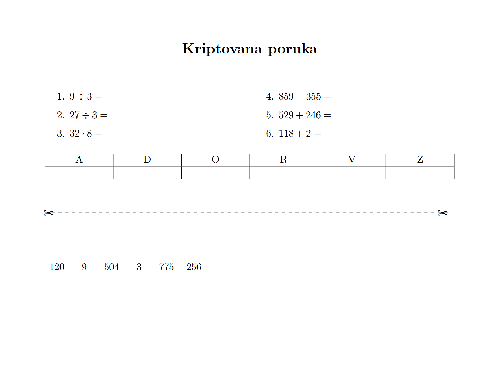

```
███████╗ █████╗ ██████╗  █████╗ ██████╗██╗ 
╚══███╔╝██╔══██╗██╔══██╗██╔══██╗██╔════╝██║
  ███╔╝ ███████║██║  ██║███████║██║     ██║
 ███╔╝  ██╔══██║██║  ██║██╔══██║██║     ██║
███████╗██║  ██║██████╔╝██║  ██║╚██████╗██║
╚══════╝╚═╝  ╚═╝╚═════╝ ╚═╝  ╚═╝ ╚═════╝╚═╝
```
# 🧮 Zadaci

**Matematički Zadaci Generator**

---

Ovaj repozitorijum sadrži Python skriptu za generisanje matematičkih zadataka u LaTeX formatu i automatsku PDF kompilaciju koristeći Docker/Podman. Takođe omogućava generisanje kriptovanih poruka koristeći zadatke kao šifru.

## 🚀 Pokretanje

1. Instalirajte Podman/Docker i WSL (Windows Subsystem for Linux)
2. Pokrenite iz komandne linije:

```bash
python zadaci.py [broj_zadataka] [ime_fajla.pdf]
python zadaci.py cypher "Poruka za šifrovanje" [ime_fajla.pdf]
```

Ako ne navedete argumente, generiše se 20 zadataka i PDF se zove `output.pdf`.

## 🧮 Primeri

Generišite 10 zadataka:

```bash
python zadaci.py 10 zadaci.pdf
```

Generišite kriptovanu poruku:

```bash
python zadaci.py cypher "Zdravo" tajna.pdf
```



## 📄 Primer zadatka

1.  $12 + 34 =$
2.  $56 - 22 =$
3.  $7 \cdot 8 =$
4.  $81 \div 9 =$


## 🛠️ Tehnički detalji

- Python 3
- LaTeX generacija
- Podman/Docker za PDF kompajlaciju
- WSL za pokretanje na Windowsu

## ✨ Autor

Ivan Savu

---

## 📜 Licenca

Ovaj projekat je licenciran pod [GNU General Public License v3.0](LICENSE).
